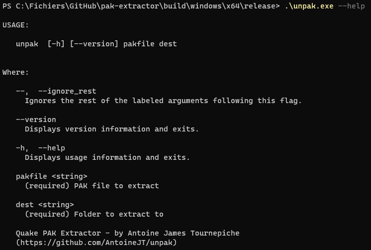

# Quake PAK Extractor
This program is written in both C and C++
in a complementary way.

It allows to extract a single PAK file
at a time for now.

I used a public domain C pak extraction
implementation as a base to my custom
current version of the extraction
algorithm.

I used C for convenience because the PAK
format has been designed to be exploited
from C code.

The C++ code parts are instead the tool
itself and the "library" behind it.

## What are those folders?
Those folders are different parts of
the program. 
They are called "targets" by the build
tool I use: [xmake](https://xmake.io/)

## What is each folder/target?
**This software has been made in a way
that allows expansion, and so it 
has 4 distinct targets.**

### cli
CLI is the commandline target, it's the
tool itself.

It needs the other parts to build.

*You can have more informations about
targets inter-dependencies by reading
the xmake.lua file.*

### common
Common is a target in which are defined
some useful macros with C and C++
implementations, to be conveniently used
in both of those languages, while
being perfectly suited to both of them.

It is used in each targets and therefore
is extremely useful, because of the
RT_* macros (particularly the RT_ENSURE* ones).

### cpak
CPAK is the target responsible for
reading/parsing the PAK files, in C.

It has a subfolder called `cxx` which
are bindings for C++ code, to make
memory management less of a pain and
more error-proof.

### unpak
Unpak is the C++ target which is the
underlying library for the cli target,
for this tool.

For now it only supports extraction of
PAK files.

## How to build?
This project is built using the
[xmake](https://xmake.io/) build 
system.

Just install it on your computer, and
then run `xmake`

*You need to have it in the PATH if you are on Windows to call it wherever you want.*

*Please note you need an Internet
connection to download the dependencies
referenced in the xmake.lua file.*

## How to use?
Just read the help below.

Antoine James Tournepiche
